This tutorial will get you started with using Orion, and provides a step by step walk-through of some of the core functionality.

##Getting Orion

You have two choices to get started with Orion.  The first is to create an account on the public server at OrionHub. To do this, visit [OrionHub](http://orionhub.org/), click **Create a new account** and enter your information. An email will be sent to confirm your address. Once confirmed, return to [OrionHub](http://orionhub.org/) and log in.

The second method to get started is to download a standalone version of the server. For instructions, see [Install Orion on Localhost](http://wiki.eclipse.org/Orion/How_Tos/Install_Orion_on_Localhost).

Once you have successfully set up an account, you can proceed to the next step.

##Logging into Orion

When you attempt to access a page that requires logging in, you'll be redirected to the Login Page and prompted for credentials.

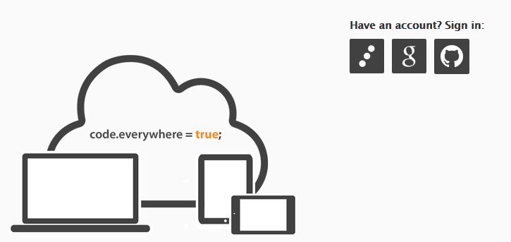

On your first visit to the login page, you can sign in using either of these ways:

* Sign in using the username and password of your Orion account.
* Sign in with a linked Google account. To link a Google account to an existing Orion account, use Orion's [Settings page](http://wiki.eclipse.org/Orion/Documentation/User_Guide/Reference/Settings_page "Orion/Documentation/User_Guide/Reference/Settings_page").
* Sign in with a linked GitHub account. To link a Github account to an existing Orion account, use Orion's [Settings page](http://wiki.eclipse.org/Orion/Documentation/User_Guide/Reference/Settings_page "Orion/Documentation/User_Guide/Reference/Settings_page").

If you are accessing a server other than OrionHub or localhost, the server administrator may have disallowed you from creating an account on the Login Page. In that case, you'll have to ask the server administrator to create one for you.

After a successful login, you will be redirected to the Orion page you were trying to access prior to login.

##Working with folders and files

In Orion, each user has a virtual root folder where various folders and files can be created.  These files are maintained on the Orion server. The [Navigator page](http://wiki.eclipse.org/Orion/Documentation/User_Guide/Reference/Navigator_page Orion/Documentation/User_Guide/Reference/Navigator_page) is used to browse and modify your files.

###Creating folders and files

First, make sure you're at the [Navigator page](http://wiki.eclipse.org/Orion/Documentation/User_Guide/Reference/Navigator_page "Orion/Documentation/User_Guide/Reference/Navigator_page") by clicking the "hamburger" menu () , and then clicking **Navigator**. The Navigator is the primary place where your files and folders will be shown. Because you haven't created any files or folders yet, the navigator is initially empty:

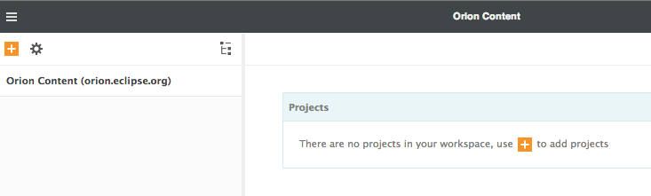

To start working with files and folders in Orion, create a folder by clicking the  menu and clicking **New Folder**:

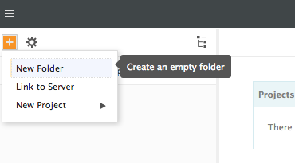

To navigate, you can either expand the folders in-place (using the &#9658; twisties), or you can click on the folder's name to drill into that folder. After you have drilled into a folder, you can navigate back up using the breadcrumb at the top of the page (pictured below). You can also use your browser's **Back** button, or a keyboard command (Alt+&#8593;) to navigate up.

###Using the common banner

The banner provides access to common operations in Orion.  The **navigation menu** (sometimes called the "hamburger") appears in the left side of the banner, and provides access to **navigation links** that take you to various pages in Orion, as well as related resources or tasks that are relevant to your current context. (For example, if you're viewing a folder inside a Git repository, a Git Log link will be shown. Clicking it takes you straight to the Git Log page for the folder.)

The right side of the banner provides a **user menu** containing Settings, Help, and other actions vaguely related to your user identity.

In the center of the banner, you'll find the **breadcrumb**, and the name of the resource being manipulated. (Some Orion pages will show a simple static title here, if you're not currently targeting any particular resource.)

Below the banner, the content of the page appears. The page toolbar contains commands. The commands act upon the current folder (unless you've made a selection in the file tree).

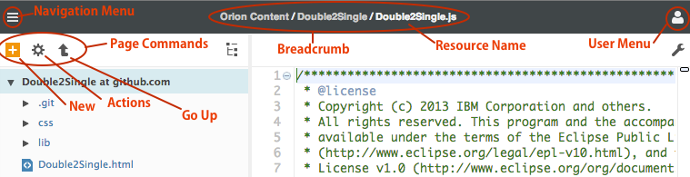

Here is a picture of the banner with the navigation and user menus expanded, to show the various links they offer:

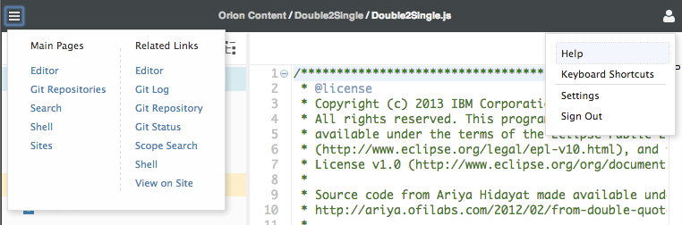

The **New** menu () contains commands for creating new files or folders, and the **Actions** menu () contains commands that apply to existing files or folders. The Go Up command lets you navigate up to the parent folder.

Files and folders may be selected by clicking their row in the tree, or by using the Ctrl and arrow keys on the keyboard. Once a selection has been made, the Actions menu will show commands that operate on the selected items (such as move, copy, and delete). If you have not made a selection, the Actions menu will show commands that act upon the folder you're currently viewing.

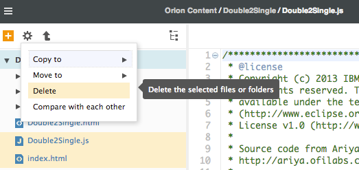

###Importing folders and files

There are many ways to import your files into Orion. You can upload a zip file, import via SFTP, or clone a Git repository.

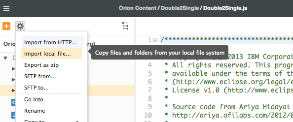

To import files from your local file system into Orion, select one or more files on your computer and simply drag them into the file tree. You can also drag Zip files into the navigator. Orion will ask you if you want to unzip the folder. This is convenient for backing up and restoring your work.

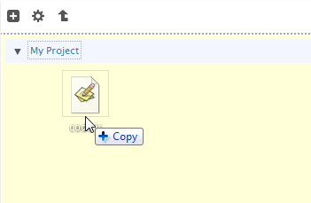

If your browser supports it, you can even drag and drop an entire folder from your OS file explorer into Orion:

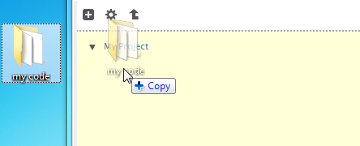

###Exporting folders and files

When you have worked with your code on Orion and are ready to export your work back to your local workstation, navigate to the folder you wish to export and choose the **Export as Zip** link.

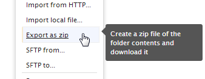

The contents of the folder will be placed in a zip file, and that zip file will be downloaded using your browser's download manager.

##Editing code

Once you've navigated to the file you want to work with, click on its link to open the [Editing page](http://wiki.eclipse.org/Orion/Documentation/User_Guide/Reference/Editing_page "Orion/Documentation/User_Guide/Reference/Editing_page").  You'll find that the editor supports the basics (cut/copy/paste, undo/redo) as well as your favorite text-editing features from Eclipse desktop (move up/down, copy up/down, go to line, find, incremental find). For now, most of these commands are accessible only through keyboard shortcuts, using the default key bindings in Eclipse desktop. To see a full list of available keyboard commands in the editor, press **Alt+Shift+?** (Ctrl+Shift+? on Mac OS). Outside of the editor, you can get the same help on any page by pressing *Shift+?*.

The editing page shows a small tree of your files in the left-hand pane. Like its larger counterpart on the Navigator page, the miniature file tree lets you perform file management actions: create files and folders, rename, delete, etc. You can even drag &amp; drop from files from your local computer into the file tree to upload them.

###JavaScript development

If you are working with JavaScript (a *.js file), the editor will syntax highlight your code. Orion provides an outline of your JS functions: click the View Options () menu to switch between the file tree and the outline.

Orion also shows markers for problem areas in your code. Integration with existing web tools is an important goal in Orion, so we have implemented a plug-in that runs [JSLint](http://www.jslint.com/) on JavaScript files in order to produce the outline and problem markers.  The familiar Eclipse problem UI is used to display the problems in the editor. You'll see problem markers beside each offending line of code in the left-hand ruler, red underlining under the problematic text, and overview problem markers to the right-hand side of the editor. These last markers allow you to navigate quickly to a problem in a part of the file that's not currently displayed.

The editor will also match brackets when you click next to a bracket, perform auto indention, and provide source-code oriented key bindings for things like toggling comments and adding/removing block comments.

Orion allows multiple kinds of code outline views to be plugged in. For example you can install the [nonymous plugin](http://johnjbarton.github.com/outliner/nonymousPlugin.html) that provides a hierarchical JavaScript outline view and an advanced way of naming anonymous JavaScript functions. If you have multiple outline views installed, the View Options menu at the top of the outline pane allows you to switch between them.

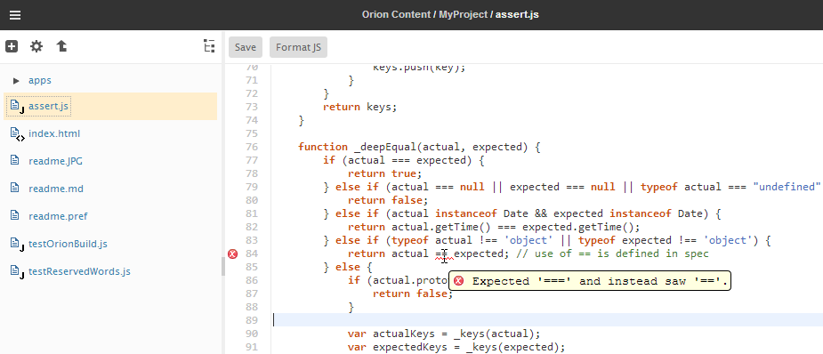 

###Firebug Integration

The Orion server is Firebug-savvy, so that recent alpha versions of Firebug, together with a Firebug extension, can invoke the Orion editor to make corrections.  For details about this, see [the Firebug wiki](http://getfirebug.com/wiki/index.php/Editing#Orion_Web_Editor).

###CSS development

Syntax highlighting of CSS files is also supported. Orion uses CSSLint to validate and check for problems in CSS files. An outline view is also provided, which shows the list of rules in your file and allows you to quickly navigate between them. As a proof of concept, Orion provides a very simple form of content assist. In Orion, our goal is to provide the plug-in points for things like content assist and outlining, allowing plug-in developers to enhance the functionality.  For now, Orion supplies a content assist based on CSS keyword proposals.  We hope to integrate existing source code analysis tools as plug-ins to enhance content assist support, outlining, and problem identification for many kinds of files.

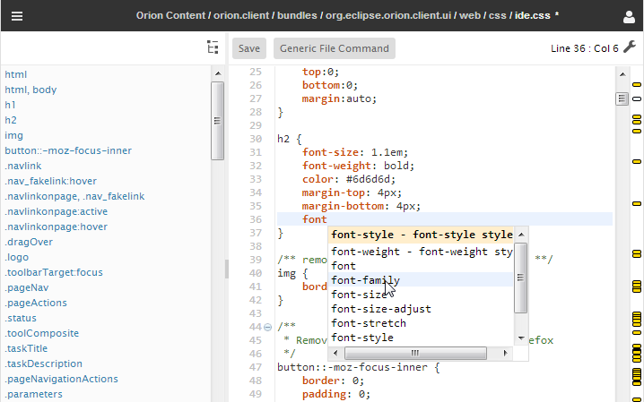

###HTML development

A simple HTML outline is provided, based on DOM ids.  Syntax highlighting is also available for HTML files.

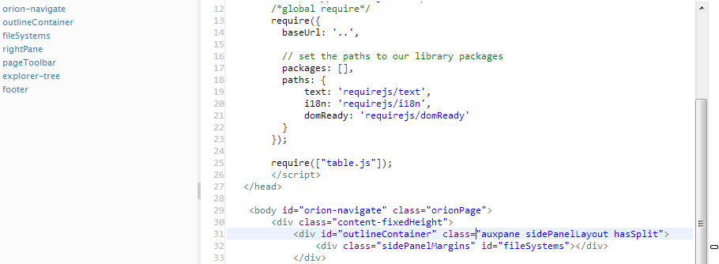

###Java development

Java syntax highlighting is also supported.  However, we have not implemented any outlining or content assist.  Since we are building an integrated web-based toolset, we felt it important to target first the web client languages such as JavaScript, CSS, and HTML, so we can attract members of the JS community to Eclipse.  Since we are [self hosting](http://wiki.eclipse.org/Orion/Getting_the_source#Self_Hosting "Orion/Getting the source#Self Hosting") Orion development in Orion, we need the JS features first.

###Extending the editor with a Plug-in

We've also implemented pluggable editor actions which allow third-party developers to extend the behavior of the Orion editor on the fly. For example, we've developed an Orion plug-in based on [the JSBeautifier code formatter](http://jsbeautifier.org) so that source code can be easily beautified. The plug-in is located at [https://orion-plugins.googlecode.com/git/0.5/plugins/beautify/jsbeautify.html](https://orion-plugins.googlecode.com/git/0.5/plugins/beautify/jsbeautify.html). Once the plug-in is installed, reload an Orion editor to see a new command appear beside rest of the editor commands. 

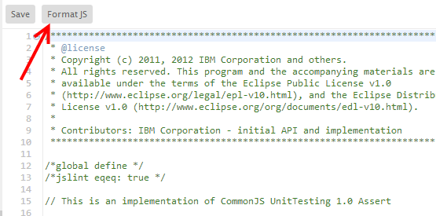

##Searching

Once you are actively using Orion, you'll find that you want to move quickly between different files and folders. There are several ways to go about this. Orion uses Apache Lucene search to provide several different search functions.

###Searching for file content

The search page is designed to perform a search for content inside your files. The scope of the search depends on how you open the search page. There are 3 ways to open the search page with a search scope.

* In any Orion page, clicking on the Navigation Menu &gt; Main Pages &gt; **Search** link will bring up the global search page. It will search all the files in your workspace.
* In the pages that focus on a single directory (for example, the Editor page), clicking Navigation Menu &gt; Related Links &gt; **Scope Search** will bring up a search page that's scoped to the current directory. Only files under the selected directory will be searched.
* You can also access the scoped directory search by selecting any directory in the file navigator and going to Actions menu (gear menu) &gt; Scope Search.

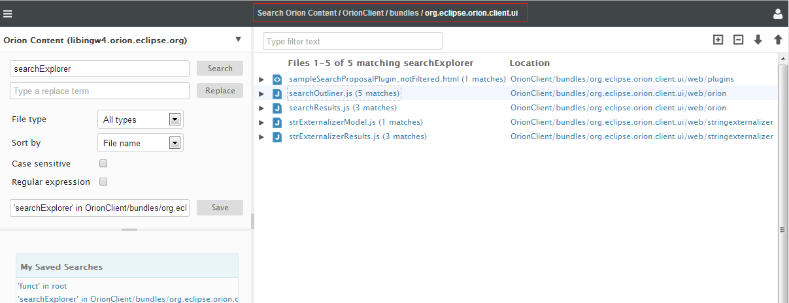

Once the [Search page](Reference/Search Results page.md "Orion/Documentation/Orion User Guide/Reference/Search Results page") is loaded, you can start to search on all criteria available on the left hand side of the page. Search results are displayed on the right-hand side.

###Finding a file by name

The **Find File Named** dialog can be opened by pressing **Ctrl+Shift+F** on your keyboard. This dialog lets you search for a file by name. Simple wildcard characters are supported.

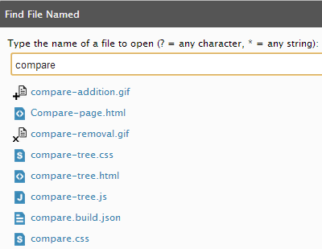

###Searching inside the editor

You can also perform a global search on a highlighted phrase from inside the editor using the **Ctrl + H** shortcut. You can also type other keywords to search the file contents on-the-fly.

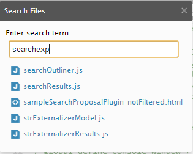

A nice side effect of editing source code in browser pages is being able to use browser mechanisms, such as the history, to quickly find files. If you find yourself working in the same handful of files, opening a new browser tab and typing in the filename will quickly get you there.

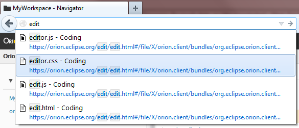

##Working with git

We intend to provide many different kinds of plug-ins for integrating Orion into open source and proprietary version control systems.  Our first example in this area is a UI for working with [Git](http://git-scm.com/) repositories. For files and folders that are managed in a Git repository, you will see a menu allowing you to navigate to various Git views dealing with the file or folder:

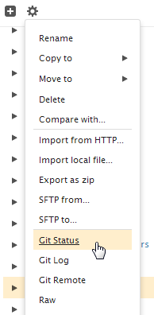

The Related pages menu will also give you contextually appropriate links to various Git pages, including the top-level of your Git repository.

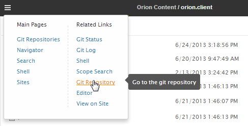

The **Git Status** page shows you all the files in your git repository that have changed, and allows you to stage, unstage, and commit changes. You can multi-select files to stage/unstage/commit using shift or ctrl.

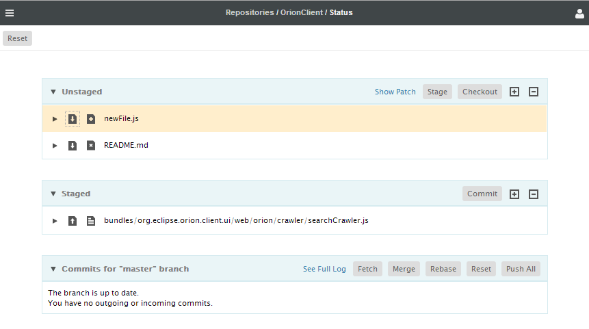

Click the twistie arrow next to a changed file to show a comparison of what changed in the file.

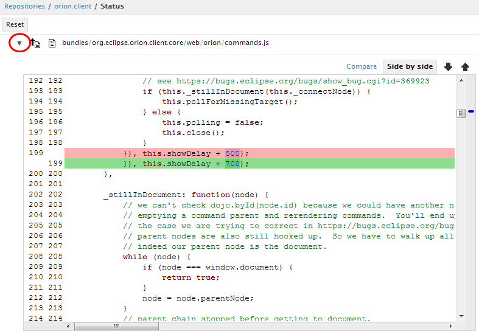

If you prefer, you can view the changes in a side-by-side comparison:

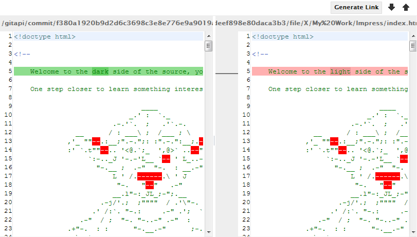

The [Git Status page](Reference/Git Status page.md "Orion/Documentation/Orion User Guide/Reference/Git Status page") shows also a list of recent commits on the active branch. You may open the [Git Log page](Reference/Git Log page.md "Orion/Documentation/Orion User Guide/Reference/Git Log page") by clicking the **Complete Log** button and see the full list of commits on that branch. Click on a commit in the log page to open the [Git Commit page](Reference/Git Commit page.md "Orion/Documentation/Orion User Guide/Reference/Git Commit page") for complete information about that commit.

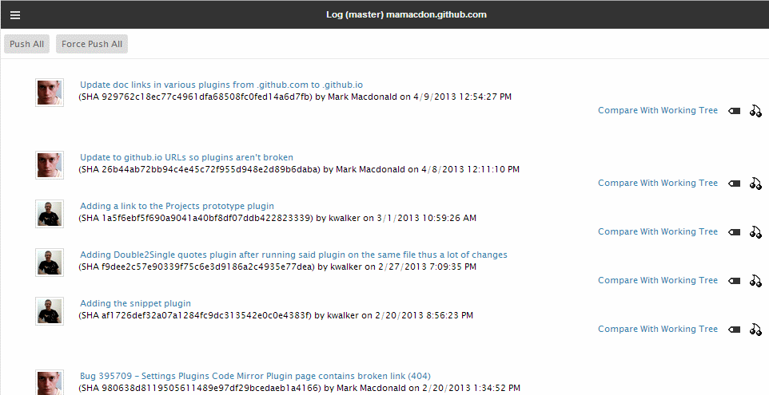

You can also open the [Compare page](Reference/Compare page.md "Orion/Documentation/Orion User Guide/Reference/Compare page") for each change in the selected commit.

##Launching your project as a website

Orion can create "sites" for testing an application developed with Orion as a stand-alone website. Click the **Sites** link on the Orion toolbar. This takes you to the [Sites page](Reference/Sites page.md "Orion/Documentation/User Guide/Reference/Sites page"), where you can create, edit, delete, or launch web sites for testing. Sites will be launched either as a sub-domain of the Orion server, or at an alternate IP address when running the server locally.

Note that if you are running your own server, and you wish to set up hosting on a sub-domain, a different IP address, or if you're running Mac OS X, you'll have to supply some more information to the Orion server. See [Configuring virtual host names](http://wiki.eclipse.org/Orion/Server_admin_guide#Configuring_virtual_host_names_for_launching_sites "Orion/Server_admin_guide#Configuring_virtual_host_names_for_launching_sites") for more detail.

You create a site by clicking the **Create Site** button and supplying a name for your site. Your new site will appear and you should fill in the path mappings for your project.  In this example the "My Work" project has an index.html in the root so just a basic path is required to mount that project at the root. Once done that step you select "Save". You have the option of starting the server from this page or refreshing the list of sites page to see your new site.

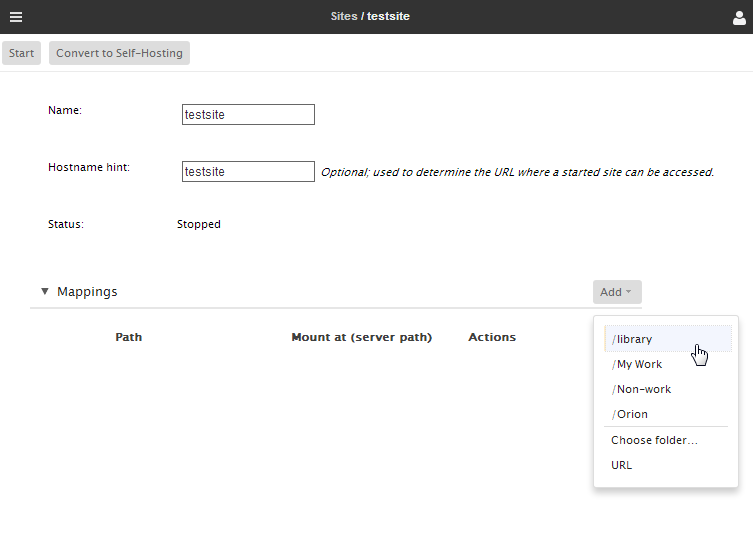

Assuming you are at the sites page you can click the **Start** button to start the site. The result will be similar to the following image, showing the site running and the URL showing where the site can be accessed.

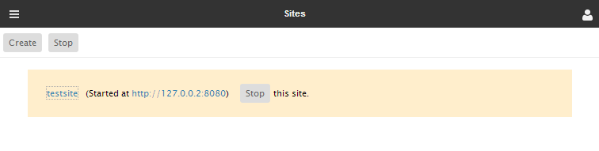

Upon visiting the site's URL, success! — We see the listing of the "My Work" directory we added.

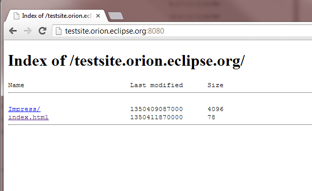

Now browse to index.html:

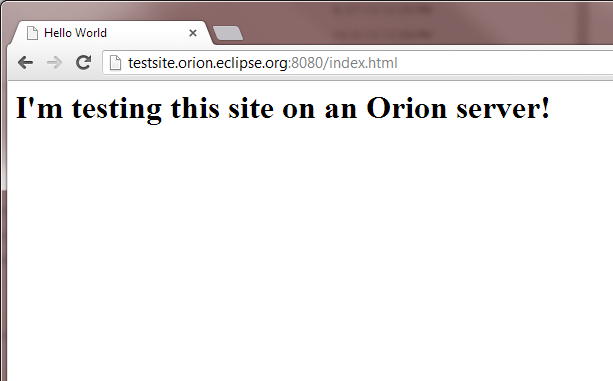

At this point, we can do incremental development by using the Orion editor to change the files in our "My Work" folder, and then simply reloading the site page to see the changes.

##Extending Orion

Orion allows developers to build plug-ins that add behavior to Orion pages. Let's learn about plug-ins by taking a look at a simple plug-in which extends the navigator.

To see what plug-ins are installed in your Orion system, open the [Settings page](Reference/Settings page.md "Orion/Documentation/Orion User Guide/Reference/Settings_page") from the **Options** menu at the top right of the Orion banner (next to the user name). Then click the **Plugins** category on the left-hand side of the screen.

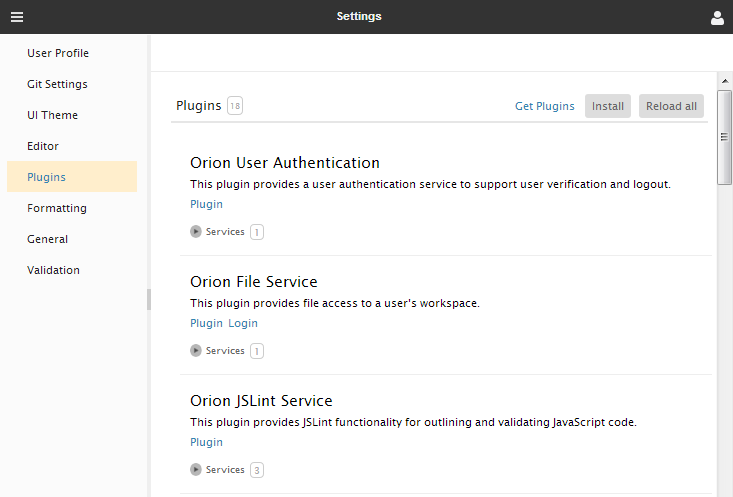

The Plugins page shows what plug-ins you have installed, and allows you to install, reload, or remove plugins. You can see that several plugins that provide Orion functionality, such as file management, user management, Git, JSLint, are already installed. Plugins extend Orion by implementing new behaviors, or *extensions* to the system. Places where "extensions" may be contributed are often called *extension points*.

###Extending the Navigator

The [orion.navigate.command](http://wiki.eclipse.org/Orion/Documentation/Developer_Guide/Plugging_into_the_navigator#orion.navigate.command "Orion/Documentation/Developer Guide/Plugging into the navigator#orion.navigate.command") extension point allows plug-ins to contribute commands that act upon files and folders in the navigator. These commands will be placed in the Actions menu. Each contributed command can specify how many and what types of files it can work with.

A sample plug-in that demonstrates the different kinds of commands you can contribute is located at [http://orionhub.org/plugins/sampleCommandsPlugin.html](http://orionhub.org/plugins/sampleCommandsPlugin.html). On the Plugins page, you can click on **Install** and paste or type this URL into the text area and press **Submit**.  When you reload the Navigator page, you will see new commands in the item action menu.

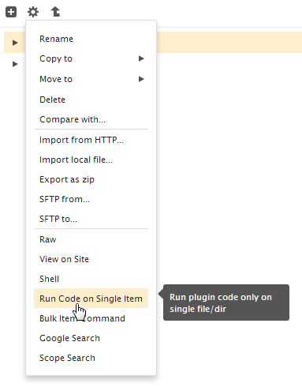

The "Bulk item command" can act on more than one item, so it will appear in the Actions menu when you select more than one item in the navigator.

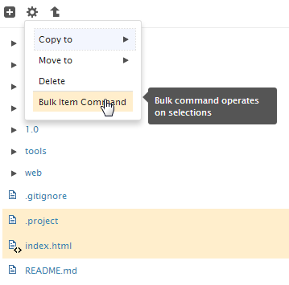

###Learning more

More information about plug-ins and extensions can be found in the [Architecture](http://wiki.eclipse.org/Orion/Documentation/Developer_Guide/Architecture "Orion/Documentation/Developer_Guide/Architecture") section in the [Orion Developer Guide](http://wiki.eclipse.org/Orion/Documentation/Developer_Guide "Orion/Documentation/Developer_Guide").  See [sampleCommandsPlugin.html](https://github.com/eclipse/orion.client/blob/master/bundles/org.eclipse.orion.client.ui/web/plugins/sampleCommandsPlugin.html) for the source code.
		
##Reporting Orion Bugs

Search the list of [open Orion bugs and feature requests](https://bugs.eclipse.org/bugs/query.cgi?bug_status=__open__&amp;product=Orion) for your issue first.

If you don't find your issue, then submit a [new Orion bug, or feature request](https://bugs.eclipse.org/bugs/enter_bug.cgi?product=Orion).

##Updating this document

This document is maintained in a collaborative wiki.  If you wish to update or modify this document please visit [http://wiki.eclipse.org/Orion/Documentation/User_Guide/Getting_started](http://wiki.eclipse.org/Orion/Documentation/User_Guide/Getting_started).
